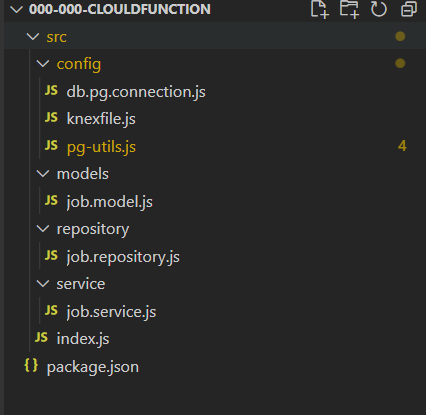
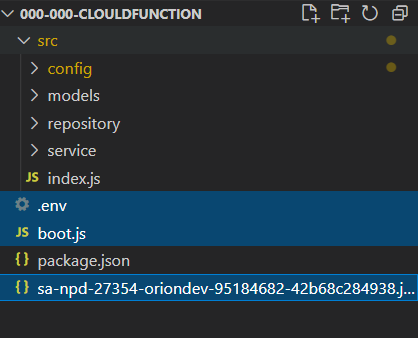
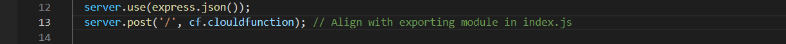
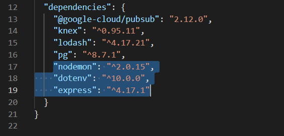
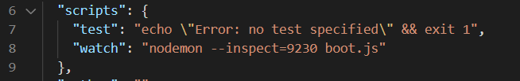
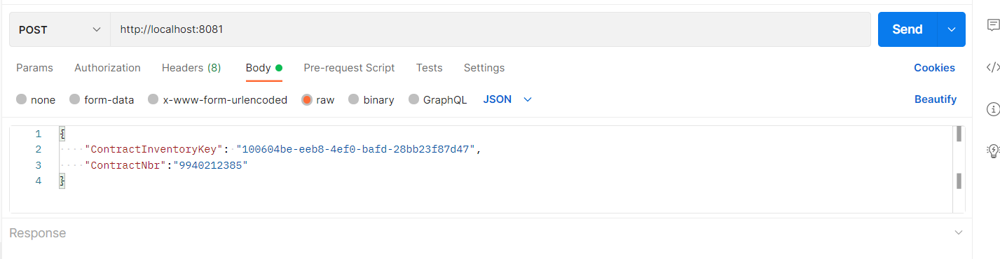
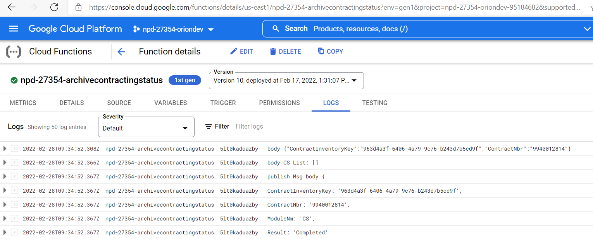

# 开发

## 代码结构

 

## 文件

### index.js

入口文件

```javascript
const archiveData = require('./job.service')

exports.clouldfunction = async (event) => {
    console.log("event", event);
    let pubsubMessage = event.data;
    let body = Buffer.from(pubsubMessage, 'base64').toString();
    if (!!body) {
        body = JSON.parse(body);
        console.log("body", JSON.stringify(body));

        await archiveData(body);
    } else {
        console.log('No event data.');
    }
}
```


## PubSub

### 接收

> 触发CF。配置订阅的Topic，tipic被触发时将执行该CF。

```javascript
let pubsubMessage = event.data;
let body = Buffer.from(pubsubMessage, 'base64').toString();
if (!!body) {
    body = JSON.parse(body);
}
```

### 发送

> 该topic被触发（app_27354_npd-archive-completion）订阅该topic的所有CF都将执行。

```javascript
const publishMessage = async (eventObj, bool) => {
    const msgObj = {
        ContractInventoryKey: eventObj.ContractInventoryKey,
        ContractNbr: eventObj.ContractNbr,
        ModuleNm: 'CS',
        Result: bool ? 'Completed' : 'Failed'
    }
    console.log('publish Msg body', msgObj);
    try {
        const topicName = 'app_27354_npd-archive-completion';
        const pubsub = new PubSub();
        const dataBuffer = Buffer.from(JSON.stringify(msgObj));
        const messageId = await pubsub.topic(topicName).publish(dataBuffer);
        console.log(`${messageId} -  Message published.`);
    } catch (err) {
        console.error("sendMsg error: ", err)
}
```


# 测试

## 本地

> 本地没有PubSub环境，只能改写code使用HTTP模拟CF被触发。本地无法测试PubSub的发送结果。**调式**程序方法同API项目相同

#### 添加文件

增加三个文件并更改部分code，使CF能够接收HTTP 请求，然后用postman模拟CF被触发。

**.env** / **sa** 文件同API项目中相同

 

**boot.js** 文件需更改。使code变为可接收HTTP请求的Express App



#### 改写入口Code

**index.js** event.body 即为 HTTP post请求中的body

```javascript
exports.clouldfunction = async (event) => {
    console.log("event", event);
    let body = event.body;
    if (!!body) {
        await archiveData(body);
    } else {
        console.log('No event data.');
    }
}
```


#### 安装本地测试所需的包

**nodemon dotenv express**

 

#### 启动程序

**npm run watch**  通过boot.js为主文件启动程序

 


#### Postman 触发CF



```json
http://localhost:8081
{
    "ContractInventoryKey": "100604be-eeb8-4ef0-bafd-28bb23f87d47",
    "ContractNbr":"9940212385"
}
```


## DEV/STAGE

### Pipeline触发CF

**参照 Pipeline** **[Execute Archive Contract Command](https://dev.azure.com/accenturecio07/NxtGenMMC_27354/_apps/hub/ms.vss-ciworkflow.build-ci-hub?_a=edit-build-definition&id=4561&view=Tab_Tasks)**

**Edit Task** 

1. 根据想要执行的环境在**Active Account and Envi**的script中找到对应的环境名、SA文件名

    

2. 创建对应环境的Task

   

3. 修改variables 

    

4. 修改测试所需数据和要触发的Tipic（一个Topic可能被多个CF订阅，运行Pipeline多个CF将被触发）

    

5. 执行Pipeline

### 在GCP中查看Log

[GCP]([Functions – Cloud Functions – npd-27354-oriondev – Google Cloud Platform](https://console.cloud.google.com/functions/list?project=npd-27354-oriondev-95184682&supportedpurview=project)) 中找到对应CF，查看Log信息

 


# 发布

> 通过Azure Pipeline 将Code 发布至GCP中并创建新的CF（自动）

## **添加文件** 

 

## CI

### **azure-pipelines.yml** 

> 创建Pipeline时将配置为根据该yml文件设置pipeline

自动触发Pipeline的code branch

自动触发Pipeline的文件改动

```javascript
trigger:
  batch: true
  branches:
    include:
    - development
    - release_V2
    - master_V2
    - release
    - R22.2_Development
   paths:
    include:
    - Infra/002-215-cf-archivecontractingstatus/*
```

根据项目名称更改

```javascript
variables:
  TF_SRC_PATH: './Infra/002-215-cf-archivecontractingstatus'
  CFName: 'mmc-cf-archivecontractingstatus'
  NodeJSVer: '12.x'
  Archive_Src_Folder: 'dist_archive'
  WebPack_Output_Folder: 'Infra/002-215-cf-archivecontractingstatus/src'
```

### **创建Pipeline**

> 在[Azure](https://dev.azure.com/accenturecio07/NxtGenMMC_27354/_build) 中创建新pipeline

1. 

2.  
3.   
4.  
5.  
6.  


## CD

### **main.tf** 

根据项目名称修改

  


### 创建Release

> 在[Azure](https://dev.azure.com/accenturecio07/NxtGenMMC_27354/_release?view=all&_a=releases&definitionId=288) 创建Release ，参考[cf-archivecontractingstatus-cd](https://dev.azure.com/accenturecio07/NxtGenMMC_27354/_releaseDefinition?definitionId=288&_a=environments-editor-preview) 

1. clone 现有 Release

    

2. 新增Artifacts，选择之前创建好的CI的路径

    

3. 修改自动触发规则，**配置成功后如pipeline执行成功将自动执行release**

    

4. 修改Deployed approver （参照[cf-archivecontractingstatus-cd](https://dev.azure.com/accenturecio07/NxtGenMMC_27354/_releaseDefinition?definitionId=288&_a=environments-editor-preview)  有些环境不需要设置approver）

    

5. 修改变量 

   $(CF_JOBARCHIVE_TRIGGER_EVENT) 对应 Variable groups 中各个环境中的值，此变量为该CF所订阅的Topic需要根据CF具体功能需求所更改

   

3. 检查Variable groups 中各个环境中是否都已经定义了 Pipeline variables 中所使用的变量（$(CF_JOBARCHIVE_TRIGGER_EVENT)）

    
